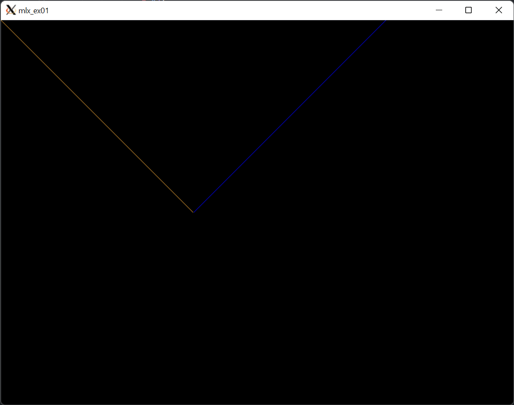

## Exmaple One : init



init window and line drwaing


how init window ?
- define struct window
```c
struct s_window {
	void	*mlx;
	void	*win;
	void	*img;
	int		*data;
	int		bpp;
	int		size_line;
	int		endian;
} t_window;

```
- call ```mlx.init()``` and assign to ```window.mlx```


```c

# define WIDTH 800
# define HEIGHT 600

int main(void)
{
    t_window	*window; // declare window struct

    window = (t_window *)malloc(sizeof(t_window)); // allocate memory for window struct
    window->mlx = mlx_init(); // init mlx
    window->win = mlx_new_window(window.mlx, WIDTH, HEIGHT, "Fractol"); // init window
    window->img = mlx_new_image(window.mlx, WIDTH, HEIGHT); // init image
    window->data = (int *) mlx_get_data_addr(window.img, &window.bpp, &window.size_line, &window.endian); // get data address

}

```

- explain all above functions ?
    - ```mlx_init()``` is a function that initialize mlx library
    - ```mlx_new_window()``` is a function that initialize window
    - ```mlx_new_image()``` is a function that initialize image
    - ```mlx_get_data_addr()``` is a function that get data address of image
    - ```window.bpp``` is the number of bits per pixel
    - ```window.size_line``` is the number of bytes in a line
    - ```window.endian``` is the endian of image


- Why I add ```(int *)``` to ```mlx_get_data_addr```?
    - Without ```(int *)``` it will return a pointer to the first element of the array.

    ```c

    window->data[(y * WIDTH) + x][0] = 0xDD;
    window->data[(y * WIDTH) + x][1] = 0x99;
    window->data[(y * WIDTH) + x][2] = 0x33;
    window->data[(y * WIDTH) + x][3] = 0xFF;
    
    ```
    
    - With ```(int *)``` it will return a pointer to the all elements of the array.
    
    ```c
    
    window->data[(y * WIDTH) + x] = 0xDD9933;
    
    ```

    > before i forget at struct data type is int pointer if i use (int *)

### Get_data_addr

- ```get_data_addr()``` is a function that get data address of image bpp, size_line, endian

- Why need to get bpp, size_line, endian ?
    - bpp is the number of bits per pixel
    - size_line is the number of bytes in a line
    - endian is the endian of image

- Echa pixel is a 4 byte array
    - [0] is the red value
    - [1] is the green value
    - [2] is the blue value
    - [3] is the alpha value

- Why alpha value is the last byte ?
    - Because alpha value is the transparency of the pixel

- How many pixel in a window ?
    - `WIDTH * HEIGHT = 800 * 600`
    - `800 * 600 * 4 = 240000` // beacuse each pixel is a 4 byte array
    - `240000 / 4 = 60000`

- How I can get Loction for echa pixel ?
    - `(y * WIDTH) + x` is the location of echa pixel
    - `y is the row` 
    - `x is the column`

- How access to pixel?
    ```c
    window->data[(y * WIDTH) + x] = 0xDD9933;
    ```
- How drawing line from `(x0, y0)->(x1, y1)`?
    ```c
    int x0 = 0;
    int y0 = 0;
    int x1 = WIDTH;
    int y1 = HEIGHT;
    
    while (y0 < y1)
    {
        window->data[(y0 * WIDTH) + x0] = 0xDD9933;
        y0++;
        x0++;
    }
    
    mlx_put_image_to_window(window->mlx, window->win, window->img, 0, 0);

    ```

- What is `mlx_put_image_to_window` ?
    - ```mlx_put_image_to_window``` is a function that put image to window
    - ```window->mlx``` is the mlx library
    - ```window->win``` is the window
    - ```window->img``` is the image
    - ```0``` is the x location of image
    - ```0``` is the y location of image
